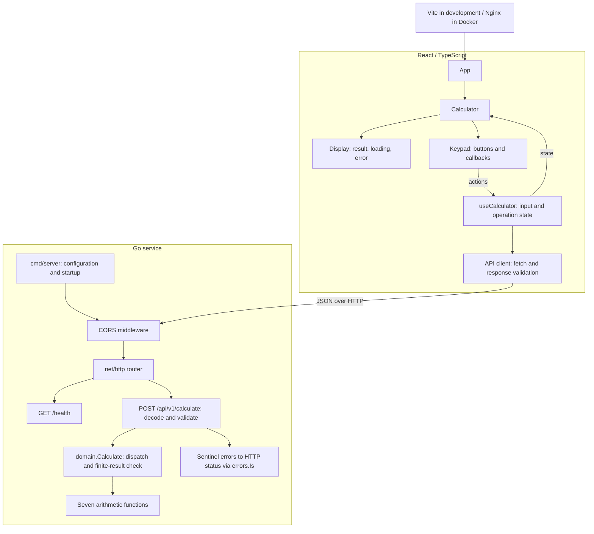

# Architecture

The application is stateless. React manages input and presentation; Go performs every arithmetic operation. The domain package depends only on the Go standard library and can be tested without a server.

## Components and layers



`Display` and `Keypad` have no calculation state or network calls. `useCalculator` tracks the displayed input, previous operand, pending operation, loading, and error. The client sends typed requests and reports backend messages to the hook. Formatting changes the visible result only; the next request uses the original number.

The HTTP layer uses pointer operands to detect absent fields. It rejects malformed or extra JSON values, unknown fields, and missing operands before arithmetic. The domain dispatcher reports unknown operations and rejects non-finite results. HTTP status mapping stays outside the domain.

## Calculation request

```mermaid
sequenceDiagram
    actor User
    participant UI as React and useCalculator
    participant Client as API client / browser
    participant CORS as CORS middleware
    participant HTTP as HTTP handler
    participant Domain as domain.Calculate

    User->>UI: Enter operands and press equals
    UI->>UI: Validate input; mark loading; disable keys
    UI->>Client: calculate(operation, a, b)
    opt Browser needs a CORS preflight
        Client->>CORS: OPTIONS with Origin and requested method
        CORS-->>Client: 204 with allowed origin, methods, and headers
    end
    Client->>CORS: POST /api/v1/calculate with JSON
    CORS->>HTTP: Forward request with CORS response headers
    HTTP->>HTTP: Decode one object and validate required fields
    alt Invalid JSON or missing fields
        HTTP-->>Client: 400 with error message
    else Request fields are valid
        HTTP->>Domain: Calculate(operation, a, b)
        alt Unknown operation or arithmetic error
            Domain-->>HTTP: Sentinel error
            HTTP->>HTTP: Map error using errors.Is
            HTTP-->>Client: 400 or 422 with error message
        else Finite result
            Domain-->>HTTP: Result
            HTTP-->>Client: 200 with result
        end
    end
    Client-->>UI: Return result or throw readable error
    UI->>UI: Update display/error and clear loading
    UI-->>User: Show result or error; enable keys
```

The diagram assumes an allowed origin. An unapproved preflight receives 403, and the browser denies access. Network failures are converted into a readable client error. The hook keeps the operands after an API error so the user can correct input or clear the calculation.

## Deployment and test boundaries

In development, Vite serves the UI on port 5173 and Go listens on port 8080. In Docker, Nginx serves the compiled UI on host port 3000; Go still uses host port 8080. The browser calls that published API address directly. Compose supplies the matching CORS origin and starts Nginx after the API health check succeeds.

The Go Dockerfile compiles a static binary in a builder stage and runs it as a non-root user in Alpine. The frontend Dockerfile builds with Node and copies only the static output into Nginx. `VITE_API_URL` is a build-time value; `CORS_ORIGIN` is read when the Go process starts.

Domain tests use input/output tables. HTTP tests use `httptest` to exercise routes, JSON validation, status mapping, and CORS. Frontend tests isolate the HTTP client with mocked `fetch`, isolate hook state with a mocked API function, and exercise the assembled UI with real click events and mocked HTTP responses. Live HTTP and browser checks cover the local and Docker integrations. See the [README](../README.md#tests-and-coverage) for commands, measured coverage, and exclusions.
