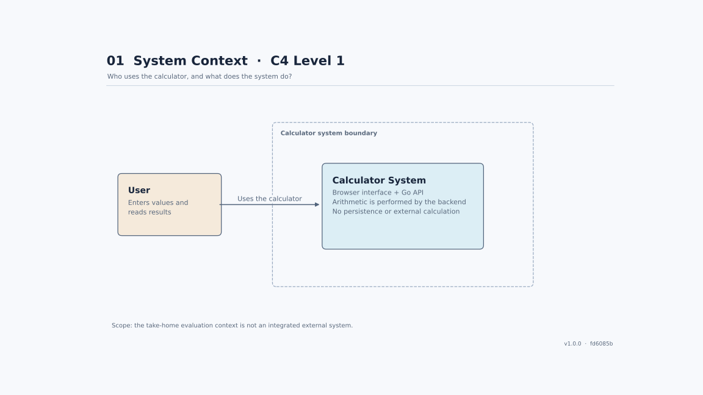
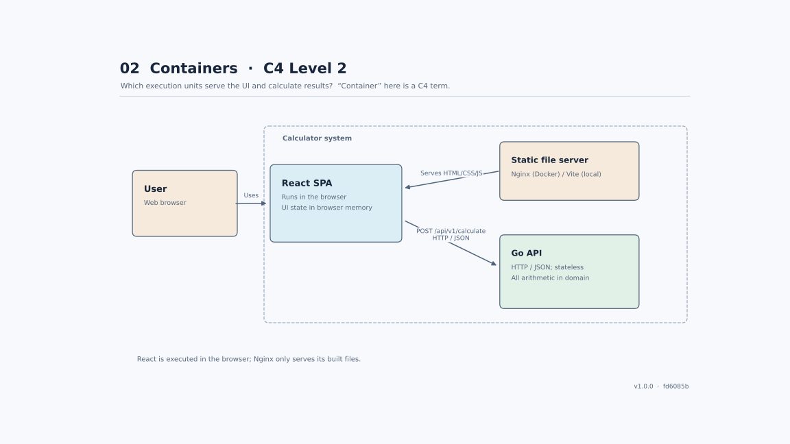
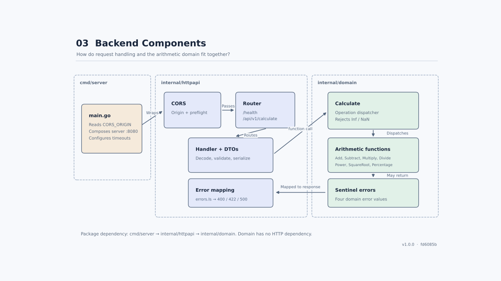
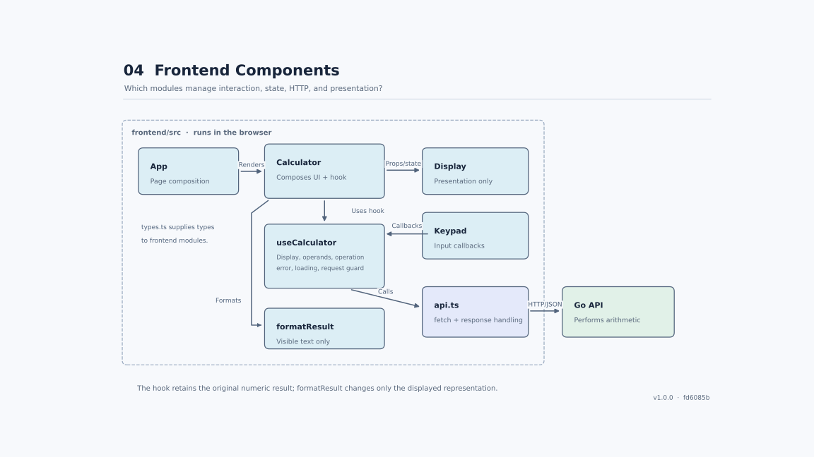
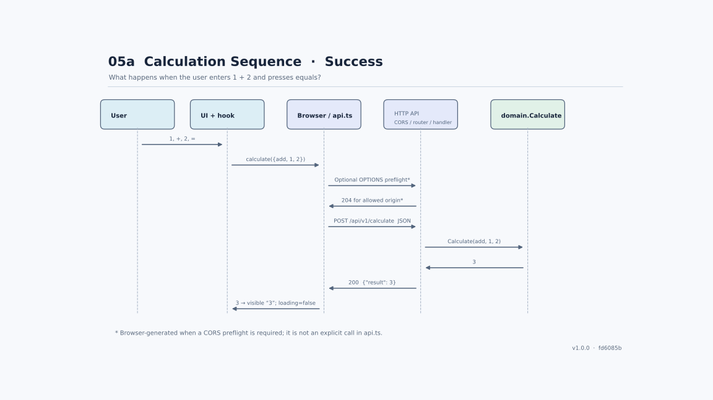
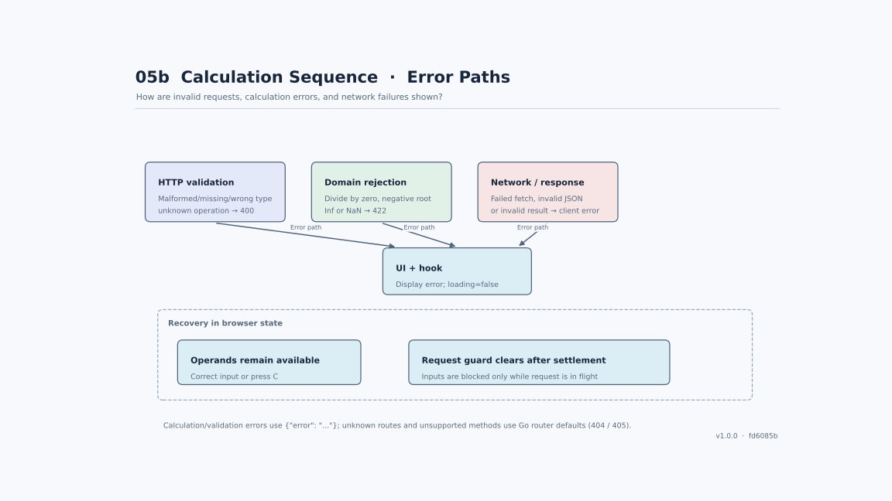
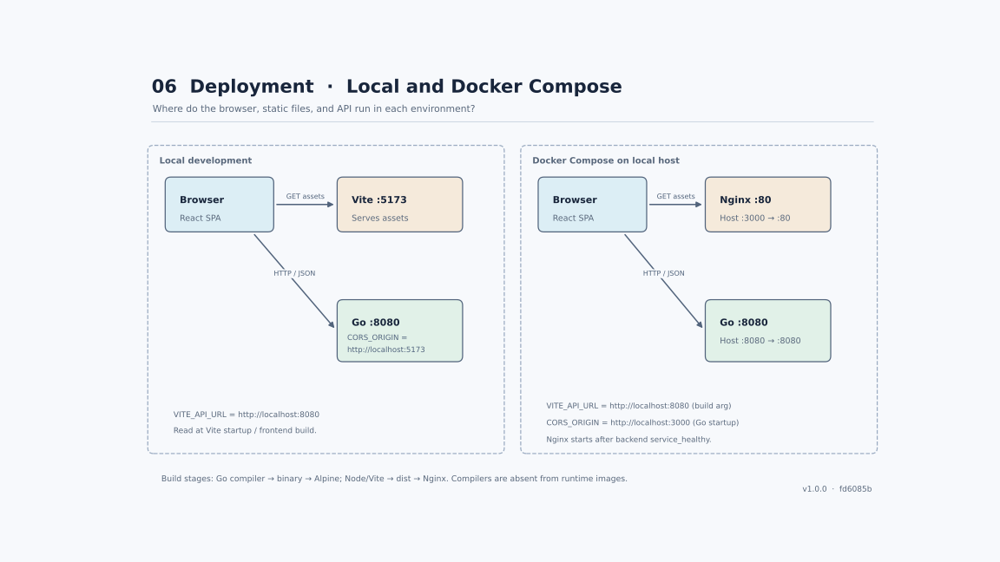
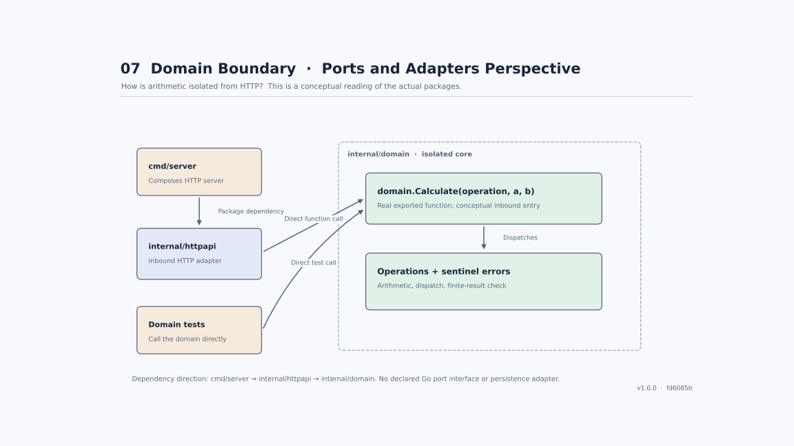
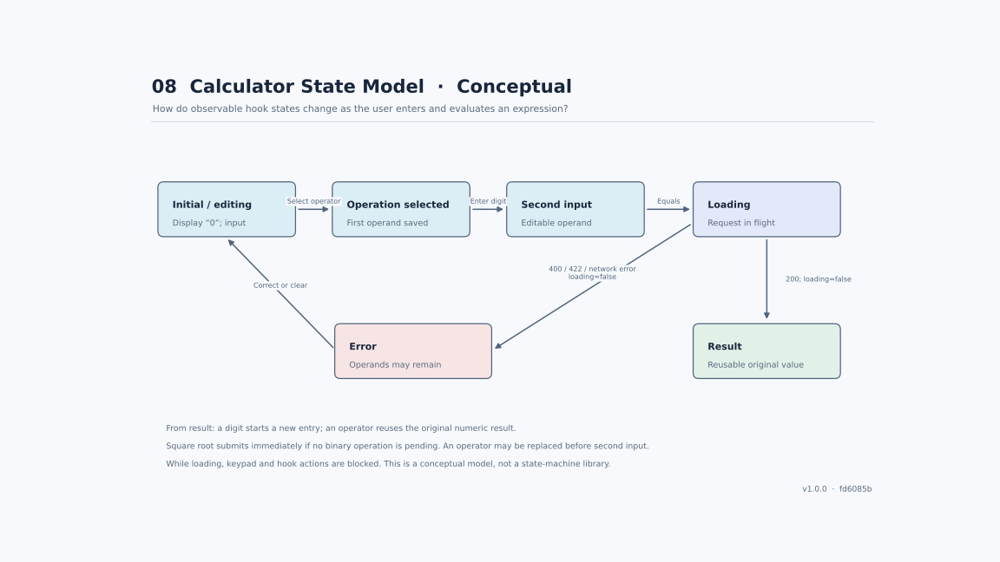
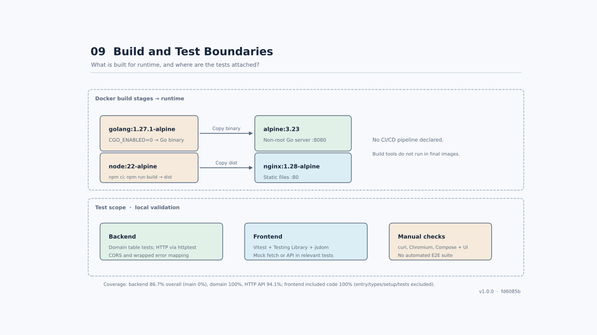

# Architecture diagram gallery

These vector diagrams describe the implementation in [v1.0.0](https://github.com/AndresVelezR/calculator---react-go/tree/v1.0.0), commit `fd6085b`. Click a diagram to open the SVG at full size. The [architecture document](../ARCHITECTURE.md) includes the editable Mermaid overview and request sequence; the [project README](../../README.md) explains setup, API usage, and measured coverage.

| View | Focus |
| --- | --- |
| [01 — System context](#01--system-context) | User and system scope |
| [02 — Containers](#02--containers) | Browser application, static server, and API |
| [03 — Backend components](#03--backend-components) | HTTP boundary and arithmetic domain |
| [04 — Frontend components](#04--frontend-components) | UI, hook, client, and formatting |
| [05a — Successful calculation](#05a--successful-calculation) | Request and response sequence |
| [05b — Calculation errors](#05b--calculation-errors) | Validation, domain errors, and recovery |
| [06 — Deployment](#06--deployment) | Local development and Docker Compose |
| [07 — Domain boundary](#07--domain-boundary) | Ports and adapters perspective |
| [08 — State model](#08--state-model) | Conceptual calculator interaction states |
| [09 — Build and test boundaries](#09--build-and-test-boundaries) | Build stages and verification scope |

## 01 — System context

A user enters numbers and reads results. The calculator has no persistence or external calculation service.

## 02 — Containers

C4 containers are execution boundaries. React runs in the browser; Vite or Nginx serves its files, and Go performs the arithmetic. The user is an external actor, not a deployed application component.

## 03 — Backend components

`cmd/server` composes `internal/httpapi`, which calls `internal/domain`. The actual routes are `GET /health` and `POST /api/v1/calculate`. `domain.Calculate` detects unknown operations and non-finite results; the HTTP layer maps sentinel errors to response statuses.

## 04 — Frontend components

`Calculator` composes the UI, uses `useCalculator`, and calls `formatResult`. The hook preserves the original result and invokes the API client. The Go API runs outside the browser boundary. Arrows show component usage, callbacks, or communication as labeled, not a single kind of import dependency.

## 05a — Successful calculation

The browser may issue a CORS preflight before sending JSON. The API returns a finite result, and the UI updates the display and clears its loading state.

## 05b — Calculation errors

Invalid requests produce 400, arithmetic domain errors produce 422, and the client handles network or malformed-response failures. Unknown operations are detected by the domain dispatcher and mapped to 400 by HTTP. Operands remain available after an API error.

## 06 — Deployment

Local development uses ports 5173 and 8080. Compose publishes Nginx on host port 3000 and Go on 8080. The browser calls Go directly; Nginx does not proxy calculation requests. `VITE_API_URL` is set at frontend build/startup, and `CORS_ORIGIN` at backend startup.

## 07 — Domain boundary

This is a ports-and-adapters interpretation of the existing packages. `domain.Calculate` is a real exported function, not a separately declared Go port interface. HTTP and tests can call the domain without introducing persistence adapters or an additional application layer.

## 08 — State model

The hook implements these observable states using React state and a request guard. This is a conceptual overview, not an exhaustive state machine or a state-machine library. An error may coexist with a pending operation; correcting an operand resumes editing, while clearing resets the calculation. All input actions are blocked during a request.

## 09 — Build and test boundaries

Docker builds a Go binary and frontend static assets in separate builder stages. Runtime images contain Alpine with the server and Nginx with the assets. Unit and interaction tests use the mocks indicated in the diagram; browser and Docker checks are manual integration checks. Coverage percentages describe v1.0.0 and retain the exclusions documented in the project README.

